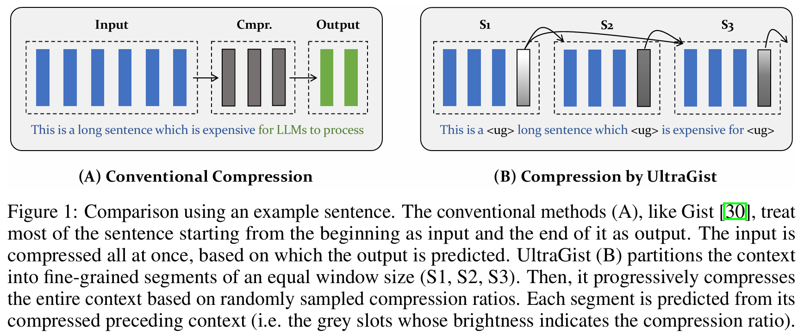

<div align="center">
<h1>Compressing Lengthy Context With UltraGist</h1>

</div>

UltraGist, a context compression method can **flexibly**, **effectively**, and **efficiently** to handle various context lengths and compression ratios.


## News
- [2024/5/27] Release data & code for training & evalation!
- [2024/5/27] Release [UltraGist for Llama-2-7b-chat](https://huggingface.co/namespace-Pt/ultragist-llama2-7b-chat) and [UltraGist for Mistral-7B-Instruct-v0.2](https://huggingface.co/namespace-Pt/ultragist-mistral-7b-inst)!


## Usage
```bash
import json
import torch
from transformers import AutoModelForCausalLM, AutoTokenizer

model_id = "namespace-Pt/ultragist-llama2-7b-chat"
# model_id = "namespace-Pt/ultragist-mistral-7b-inst"

tokenizer = AutoTokenizer.from_pretrained(
  model_id, 
  trust_remote_code=True,
)
model = AutoModelForCausalLM.from_pretrained(
  model_id, 
  trust_remote_code=True, 
  torch_dtype=torch.bfloat16, 
  attn_implementation="sdpa",
  # load the entire model on the default gpu
  device_map={"": "cuda"}, 
).eval()


with torch.no_grad():
  # long context
  with open("data/toy/nqa.json", encoding="utf-8") as f:
    example = json.load(f)
    content = f"Context:\n\n{example['context']}\n\nAnswer the following question based on the above context.\nQuestion:\n{example['input']}"
  messages = [{"role": "user", "content": content}]
  inputs = tokenizer.apply_chat_template(messages, tokenize=True, add_generation_prompt=True, return_tensors="pt", return_dict=True).to("cuda")

  # reset memory before new compression task
  model.memory.reset()

  # directly call generate to progressively compress the context while generating next tokens
  outputs = model.generate(**inputs, do_sample=False, top_p=1, temperature=1, max_new_tokens=40)[:, inputs["input_ids"].shape[1]:]
  print("*"*20)
  print(f"Input size:       {inputs['input_ids'].shape[1]}")
  print(f"Question:         {example['input']}")
  print(f"Answers:          {example['answers']}")
  print(f"Prediction:       {tokenizer.decode(outputs[0], skip_special_tokens=True)}")
  print("*"*20)

  # extract the compressed memory (including the generated tokens)
  compressed_memory = model.memory.get_memory()
  ultragist_size, raw_size, sink_size = model.memory.get_memory_size()
  print(f"UltraGist size:   {ultragist_size}")
  print(f"Raw size:         {raw_size}")
  print(f"Sink size:        {sink_size}")
  print(f"Memory:           {compressed_memory[0][0].shape}")
  print("*"*20)
```

## Envionment
```bash
conda create ultragist python=3.10.14

conda activate ultragist

conda install pytorch pytorch-cuda=12.1 -c pytorch -c nvidia
pip install transformers==4.39.3 deepspeed==0.14.0 accelerate datasets peft
pip install flash-attn --no-build-isolation

# these packages are used in evaluation
pip install rouge fuzzywuzzy jieba python-Levenshtein pandas seaborn
```

## Data
You should download the data for fine-tuning & evaluation then untar the file at anywhere you prefer, e.g. `/data`, which results in a folder `/data/ultragist`:
```bash
# feel free to alternate /data to your prefered location
wget https://huggingface.co/datasets/namespace-Pt/projects/resolve/main/ultragist.tar.gz?download=true -O /data/ultragist.tar.gz

cd /data
tar -xzvf ultragist.tar.gz
```

**IMPORTANT NOTE**

For any path specified for `train_data` and `eval_data`: if it is prefixed with `ultragist:`, it will be solved to the relative path against [`data_root`](../src/args.py). 
  - e.g. `ultragist:longeval/topic_retrieval.json` becomes `${data_root}/longeval/topic_retrieval.json`
  - you can modify the default value of [`data_root`](../src/args.py), so that you don't need to type it for each command.


## Training
Refer to [training documentation](./docs/training.md) for evaluation.

## Evaluation
Refer to [evaluation documentation](./docs/evaluation.md) for evaluation.

## Citation
```
```
